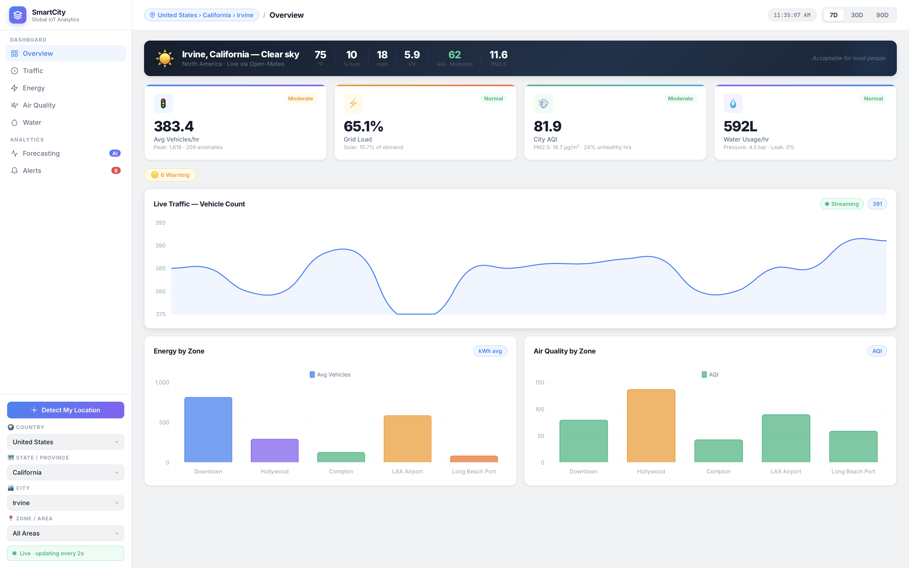

# 🌍 SmartCity IoT Analytics Platform — Global Edition


> A production-grade, real-time IoT monitoring and analytics platform covering **70+ countries, all states/provinces, and thousands of cities worldwide**. Monitors traffic, energy, air quality, and water infrastructure with live weather integration, ML forecasting, and intelligent alerting — all with zero API keys required.

---

## 📸 Dashboard Preview



---

## 🎬 Demo Video

▶️ **[Watch full demo on Google Drive](https://drive.google.com/file/d/1Q8Z68N47CGhbcAkOI90qtQUiWut_Qkpv/view?usp=sharing)**

---

## ✨ Key Features

### 🗺️ Global Location Hierarchy
- **Country → State/Province → City → Area/Neighbourhood** — 4-level cascade covering the entire world
- 70+ countries with all states and major cities hardcoded (instant, no network dependency)
- Real neighbourhood-level areas fetched dynamically via **OpenStreetMap Nominatim**
- **Auto-detect location** — click 📍 and it reverse-geocodes your GPS coordinates, then cascades through all 4 dropdowns automatically

### 📡 Live Data — Zero API Keys
- **Live weather** per city: temperature, feels-like, humidity, wind speed, UV index — via [Open-Meteo](https://open-meteo.com/)
- **Live Air Quality**: AQI, PM2.5, PM10, NO₂, ozone, CO — via [Open-Meteo AQI API](https://air-quality-api.open-meteo.com/)
- **Geocoding**: any city in the world resolved to lat/lon — via Open-Meteo Geocoding API
- Topbar breadcrumb shows full location trail: `India › Maharashtra › Mumbai`

### 🤖 MLE-Grade Analytics
- **Isolation Forest** anomaly detection (production-grade unsupervised ML)
- **ARIMA + Prophet dual forecast** — MAPE computed for both, best model auto-selected and highlighted
- **Confidence intervals** rendered for both models on the same chart
- **Week-over-week comparison** on every domain
- **City-seeded deterministic data** — Phoenix gets high solar + low rain; Delhi gets high AQI + dense traffic

### 🔔 Smart Alert System
- Tiered: **CRITICAL** / **WARNING** with natural language messages
- Scans last 3 hours of readings across all zones
- Live badge on nav with pulse animation for critical alerts

### 📊 Full Dashboard

| Page | What you see |
|---|---|
| **Overview** | Live weather banner · KPI cards · Live traffic stream · Vehicle & AQI by zone |
| **Traffic** | Live stream · Speed by zone · 24h pattern · Week-over-week |
| **Energy** | Live stream · Consumption by zone · Solar % · Week-over-week |
| **Air Quality** | Live stream · AQI by zone (colour-coded) · PM2.5 · Week-over-week |
| **Water** | Live stream · Usage by zone · Pipe leak risk · Week-over-week |
| **Forecasting** | ARIMA vs Prophet with MAPE chips · Isolation Forest anomaly scatter |
| **Alerts** | Summary cards (Critical/Warning/OK) · Full natural-language alert list |

---

## 🏗️ Architecture

```
smart-city-iot/
├── backend/
│   ├── main.py                    # FastAPI app — registers all routers
│   ├── routes/
│   │   ├── traffic.py             # /api/traffic/* 
│   │   ├── energy.py              # /api/energy/*
│   │   ├── air_quality.py         # /api/air-quality/*
│   │   ├── water.py               # /api/water/*
│   │   ├── forecast.py            # ARIMA + Prophet + Isolation Forest
│   │   ├── alerts.py              # Tiered threshold scanning
│   │   ├── city.py                # Live weather + AQI via Open-Meteo
│   │   └── geo.py                 # Country/State/City/Area hierarchy
│   └── services/
│       ├── city_profiles.py       # 55+ city climate profiles
│       ├── generator.py           # City-aware synthetic IoT generator
│       └── data_loader.py         # Per-city CSV cache
├── frontend/
│   ├── index.html                 # Single-page app — 7 pages
│   ├── css/style.css              # Full design system
│   └── js/
│       ├── api.js                 # API client
│       ├── charts.js              # Chart.js config + helpers
│       └── dashboard.js           # App controller — routing, geo cascade, live stream
├── screenshots/
└── requirements.txt
```

---

## 📊 Dataset

### Synthetic IoT Telemetry

90 days of hourly readings across **5 city-specific zones** per city. Seeded per city — deterministic and reproducible.

| Domain | Records per city | Key Metrics |
|---|---|---|
| Traffic | 5 zones × 2,160 hrs = **10,800** | Vehicle count, avg speed km/h, congestion index |
| Energy | 5 zones × 2,160 hrs = **10,800** | Consumption kWh, solar generation kWh, grid load % |
| Air Quality | 5 zones × 2,160 hrs = **10,800** | AQI, PM2.5 μg/m³, PM10, CO₂ ppm |
| Water | 5 zones × 2,160 hrs = **10,800** | Usage L/hr, pressure bar, pipe leak risk |
| **Total** | **43,200 per city** | Auto-generated on first load, cached to CSV |

### City Climate Profiles (55+ cities)

Each city has a real climate-derived profile that shapes its synthetic IoT data:

| Parameter | Phoenix | Seattle | Delhi |
|---|---|---|---|
| `solar_index` | 0.97 (desert) | 0.30 (overcast) | 0.72 |
| `rain_factor` | 0.05 (dry) | 0.82 (wet → clean air) | 0.30 |
| `traffic_density` | 1.00 | 0.88 | 1.90 (very dense) |
| `industrial_aqi` | 20 | 5 (clean) | 55 (high pollution) |
| `energy_scale` | 1.48 (AC-heavy) | 0.88 (mild) | 1.25 |

### Live Data Sources

| Source | Data | API Key |
|---|---|---|
| [Open-Meteo Weather](https://open-meteo.com/) | Temperature, humidity, wind, UV | ❌ Free |
| [Open-Meteo AQI](https://air-quality-api.open-meteo.com/) | AQI, PM2.5, PM10, NO₂, ozone | ❌ Free |
| [Open-Meteo Geocoding](https://geocoding-api.open-meteo.com/) | City → lat/lon | ❌ Free |
| [Nominatim OSM](https://nominatim.openstreetmap.org/) | Neighbourhood names | ❌ Free |

---

## 🤖 Models & Algorithms

### Time Series Forecasting

| Model | Config | Strength |
|---|---|---|
| **ARIMA** | order=(2,1,2) | Short-term precision, handles non-stationarity |
| **Prophet** | daily + weekly seasonality, 95% CI | Handles seasonality and missing data |

Both run on the same 24-hour window. MAPE computed for each — lower-MAPE model highlighted with ✓.

### Anomaly Detection

**Isolation Forest** — `sklearn.ensemble.IsolationForest(contamination=0.03, n_estimators=100)`  
Handles non-Gaussian distributions, no stationarity assumption. Falls back to z-score if sklearn unavailable.

### Alert Thresholds

| Metric | Warning | Critical |
|---|---|---|
| AQI | > 100 | > 150 |
| PM2.5 | > 35 μg/m³ | > 55 μg/m³ |
| Congestion Index | > 0.70 | > 0.90 |
| Grid Load | > 80% | > 95% |
| Pipe Leak Risk | > 0.70 | > 0.85 |
| Water Pressure | — | < 3.0 bar |

---

## 🛠️ Tech Stack

### Backend
| Tech | Version | Purpose |
|---|---|---|
| **Python** | 3.11+ | Core language |
| **FastAPI** | 0.110+ | REST API — async, auto docs at `/docs` |
| **uvicorn** | 0.28+ | ASGI server |
| **pandas** | 2.0+ | Data manipulation + CSV I/O |
| **numpy** | 1.26+ | Numerical generation + seeded simulation |
| **statsmodels** | 0.14+ | ARIMA implementation |
| **Prophet** | 1.1.4+ | Meta time series forecasting |
| **scikit-learn** | 1.4+ | Isolation Forest |
| **httpx** | 0.27+ | Async HTTP for live APIs |

### Frontend
| Tech | Purpose |
|---|---|
| **Vanilla JS (ES2022)** | No framework — fast, zero build step |
| **Chart.js 4.4** | All charts (line, bar, scatter) |
| **Inter** (Google Fonts) | Typography |
| **CSS Custom Properties** | Full design token system |

---

## 🚀 Quick Start

```bash
# 1. Clone
git clone https://github.com/Mish926/smart-city-iot.git
cd smart-city-iot

# 2. Install dependencies
pip install -r requirements.txt

# 3. Run
uvicorn backend.main:app --reload --port 8000

# 4. Open
# http://localhost:8000
```

No `.env`, no API keys, no database. IoT data auto-generates on first city load and caches to CSV.

---

## 📡 Key API Endpoints

Full docs at `http://localhost:8000/docs`

| Endpoint | Description |
|---|---|
| `GET /api/geo/countries` | All 70+ countries |
| `GET /api/geo/states?country=India` | All states |
| `GET /api/geo/cities?country=India&state=Maharashtra` | Cities in state |
| `GET /api/geo/areas?city=Mumbai&state=Maharashtra&country=India` | Real neighbourhoods |
| `GET /api/city/{city}` | Live weather + AQI |
| `GET /api/city/nearest?lat=19.08&lon=72.88` | Nearest city profile |
| `GET /api/forecast/energy?city=Mumbai` | ARIMA + Prophet + MAPE |
| `GET /api/forecast/anomalies?city=Mumbai` | Isolation Forest |
| `GET /api/alerts?city=Delhi` | Tiered alerts |

---

## 👩‍💻 Author

**Mishika Ahuja** — MS Data Science, UC Irvine

[](https://github.com/Mish926)

---

## 📄 License

MIT © Mishika Ahuja
